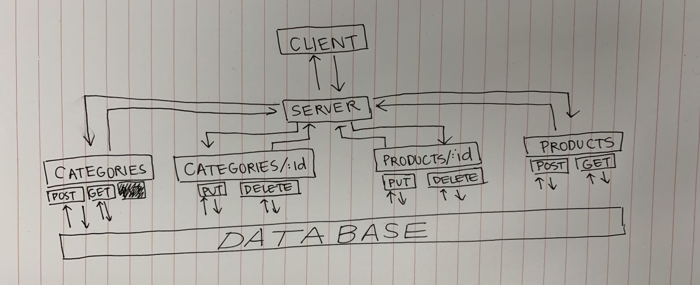

 LAB
=================================================

## Data Modeling

### Author: Melissa Stock

### Links and Resources
* [submission PR](https://github.com/401-advancedjs/data-modeling/pull/1)
* [travis](https://www.travis-ci.com/401-advancedjs/data-modeling)

#### Documentation
* [mongoose docs](https://mongoosejs.com/docs/middleware.html)

### Modules
#### `categories.js`
#### `categories-schema.js`
#### `products.js`
#### `products-schema.js`

##### Exported Values and Methods

###### `post(entry) -> JSON object containing entry`
###### `get(_id) -> JSON object with _id`
###### `put(id_, entry) -> JSON object with _id containing updated entry`
###### `delete(_id) -> deletes JSON object with _id`

### Setup
#### `.env` requirements
* `PORT` - Port Number
* `MONGODB_URI` - URL to the running mongo instance/db

#### Running the app
* `http [options: post/get/put/delete] localhost:3000`
* Endpoint: `/categories`
  * Returns a JSON object with all categories information in it.
* Endpoint: `/categories/:id`
  * Returns a JSON object with the specified category information in it.
* Endpoint: `/products`
  * Returns a JSON object with all products information in it.
* Endpoint: `/products/:id`
  * Returns a JSON object with the specified product information in it.
  
#### Tests
* How do you run tests? `npm run test`
* What assertions were made?
  * DB should be able to run the following commands:  get(), post(), put(), delete() on both routes
  * DB should throw an error if it unsuccessfully runs the following commands: get(), post(), put(), delete() on both routes
* What assertions need to be / should be made?
  * testing on server
  * testing on middleware

#### UML

